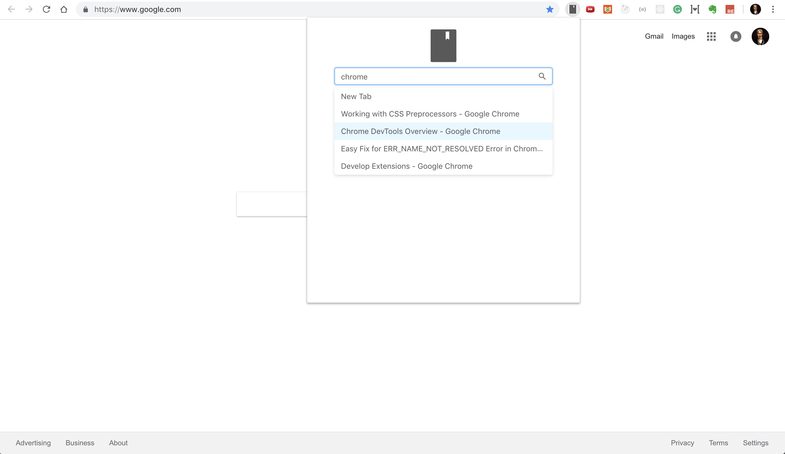

# Bookmark Search
A Chrome extension for searching bookmark quickly.

## Installation

Get it from Chrome web store: [Bookmark Search](https://chrome.google.com/webstore/detail/bookmark-search/pidmfcbodnhpmapcgchdkhpahjhfhlkc)

## Install Manually
- Clone this repository
- Go to root of the project then run `yarn & yarn build`
- Open Chrome. Go to `chrome://extensions` management page, Click *Load unpacked* button, then select extension folder of this project on your disk.

## Shortcuts
- Ctrl+Shift+P: Toggle Bookmark Search popup window.(replace `Ctrl` with `Command` for macOS users).